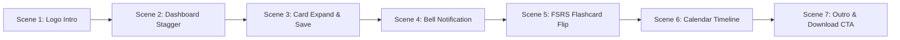

# 🎬 WordRoot — Official Promo Video Storyboard & Animation Script

**Target Duration**: 35–45 Seconds  
**Format**: 16:9 Landscape (YouTube / Google Play Store Promo Video) & 9:16 Vertical (Shorts/Reels)  
**Style**: 3D Clean Hand Device Interaction, Dynamic Camera Zooms, Smooth Staggered Animations, Squeeze/Shrink Button Physics & Tactile Haptic SFX  
**Color Palette**: Minimalist Off-White (`#FBFBFA`), Deep Charcoal (`#1A1A1A`), Crisp Shadow Depth  

---

## 🎵 Audio Track & Sound Design Direction
* **Background Music**: Upbeat, modern, sophisticated lo-fi / tech-minimalist rhythm with subtle build-up.
* **Sound Effects (SFX)**:
  * High-speed kinetic whoosh (logo spin & shrink).
  * Crisp typewriter mechanical clicks (title reveal).
  * Soft tactile UI pops & haptic thuds (card expand, button squeeze/press).
  * Subtle bell chime (notification alert popup).
  * 3D card swoosh (flashcard flip animation).

---

## 📽️ Scene-by-Scene Animation Breakdown

---

### **Scene 1: Epic Logo Launch & Brand Reveal (0:00 – 0:04)**

* **Visual**:
  * The screen starts clean off-white. The WordRoot Logo icon fills the entire screen dimension.
  * **Motion**: As playback starts, the logo begins spinning at high speed, rapidly shrinking down towards the exact center of the screen with a smooth ease-out deceleration.
  * Once the logo rests in the center, the typography **"WordRoot"** reveals letter-by-letter smoothly (typewriter style) directly below the logo.
* **Camera**: Front-facing locked center.
* **SFX**: High-speed kinetic whoosh -> Smooth bass drop -> Mechanical keyboard click as letters appear.
* **On-Screen Text**: `WordRoot`

---

### **Scene 2: Staggered Dashboard Entrance (0:04 – 0:08)**

* **Visual**:
  * The logo transition fades into a sleek, floating smartphone frame displaying the **WordRoot Dashboard**.
  * **Staggered Animation**: UI elements glide in sequentially with spring physics:
    1. Greeting Header (`Level up your vocab! 🚀 Alex 👋`) with Search & Bell icons.
    2. Main **"Today's Vocabulary"** card with word list.
    3. Stats Cards (**Today's Words** & **Vocabulary Library**).
    4. Floating Bottom Navigation Bar.
* **Camera**: Gentle smooth zoom toward the upper half of the device screen.
* **SFX**: Soft sequential cascading UI whooshes (`pop`, `pop`, `pop`).
* **On-Screen Caption**: `Your Daily Vocabulary Hub`

---

### **Scene 3: Quick Capture, Typing Zoom & Squeeze Save (0:08 – 0:16)**

* **Visual**:
  * A stylized, realistic 3D hand enters the frame.
  * Hand taps the **"Today's Vocabulary"** card (+) area.
  * **Card Expansion**: The card smoothly expands into the Vocab Editor modal.
  * **Dynamic Zoom**: Camera zooms smoothly in on the active text input box as the user hand types new words and meanings.
  * Camera dynamically pans down toward the **"Save"** button.
  * Hand taps the **"Save"** button -> **Button Animation**: Squeeze/shrink press physics (`scale: 0.94` -> `1.0` spring bounce).
  * The card smoothly minimizes back into the clean dashboard layout.
* **SFX**: Gentle tap -> Fast soft keystroke clicks -> Satisfying tactile haptic button click sound.
* **On-Screen Caption**: `Capture & Organize Words Instantly`

---

### **Scene 4: Smart Notification Alert & Review Trigger (0:16 – 0:22)**

* **Visual**:
  * On the dashboard header, an animated **red notification alert badge** pops up with a subtle bounce on the **Bell Icon**.
  * **Camera Zoom**: Camera zooms right into the top-right Bell Icon.
  * Hand taps the Bell Icon -> The **Notifications Drawer** glides in from the right showing **"Pending Reviews"**.
  * Camera focuses on the active **"Review"** button next to today's batch (`13-09-2026 - 5 Words`).
  * Hand presses the **"Review"** button with a distinct **squeeze & shrink** press animation.
  * Screen seamlessly transitions directly into the **Vocabulary Review Page**.
* **SFX**: Bright soft bell chime (`ding!`) -> Button click thud -> Smooth slide-in whoosh.
* **On-Screen Caption**: `Never Miss a Review Session`

---

### **Scene 5: FSRS Flashcard & Active Recall Flip (0:22 – 0:30)**

* **Visual**:
  * The **Vocabulary Review** page loads showing `NEXT DUE BATCH - FSRS Spaced Repetition`.
  * Hand taps the prominent **"▶ Start Review"** button (button shrinks and bounces back).
  * Flashcard Deck appears with stacked 3D cards. The top card shows: **"defenestration"** and *"Tap to reveal meaning"*.
  * Hand taps **"Flip Card to Reveal"**.
  * **Card Flip Physics**: The card expands slightly, executes a smooth 3D flip animation, and settles with a soft spring landing.
  * The back of the card reveals the definition: *"The act of throwing someone or something out of a window."*
  * Two rating buttons appear below: **"Forgot"** & **"Remember"**.
  * Hand taps **"✓ Remember"** with button press feedback.
* **SFX**: Button press -> 3D card whoosh flip -> Satisfying success chime.
* **On-Screen Caption**: `Science-Backed Spaced Repetition (FSRS)`

---

### **Scene 6: Timeline & Calendar Activity Navigation (0:30 – 0:36)**

* **Visual**:
  * Flashcard session completes with a checkmark.
  * Camera pans smoothly down to the bottom floating navigation bar.
  * Hand taps the **Calendar** tab icon.
  * The **Calendar & History** page glides in, showcasing the September 2026 activity grid with daily word pills and the day's learned vocabulary timeline below.
* **Camera**: Pulls back to show the full device in a premium 3D perspective.
* **SFX**: Soft tab switch sound -> Clean glide whoosh.
* **On-Screen Caption**: `Explore Your Learning Timeline`

---

### **Scene 7: Outro & Call to Action (0:36 – 0:42)**

* **Visual**:
  * The phone mockup gently rotates slightly and fades to the center.
  * Background lights up with an elegant minimalist studio glow.
  * WordRoot Icon & Typography appear boldly:
    * **WordRoot**
    * *Master Vocabulary Effortlessly*
  * **Google Play Store badge** pops up in the center.
* **SFX**: Uplifting outro chord -> Soft celebratory sparkle shimmer.
* **On-Screen Text**:
  * `WordRoot`
  * `Download Now on Google Play`

---

## 🛠️ Motion Designer & Video Editor Quick Reference

| Timestamp | Screen / Asset | Primary Animation / Hand Interaction | Camera Action |
|---|---|---|---|
| **0:00 – 0:04** | App Logo | Fullscreen spin & shrink to center + Letter-by-letter reveal | Static front centered |
| **0:04 – 0:08** | Dashboard | Staggered entrance for all dashboard components | Smooth push-in |
| **0:08 – 0:16** | Dashboard / Card Modal | Hand taps card, expands, typing, zoom to Save, squeeze press | Dynamic zoom & pan to button |
| **0:16 – 0:22** | Bell / Notifications | Red alert badge popup, tap Bell, slide drawer, squeeze Review | Tight zoom on Bell & button |
| **0:22 – 0:30** | Review / Flashcard Deck | Start Review, 3D card flip animation, rate Remember | Focus on card flip & buttons |
| **0:30 – 0:36** | Navigation & Calendar | Tap Calendar tab, smooth page transition to Timeline | Pan down & pull out |
| **0:36 – 0:42** | End Card / Store CTA | Logo lockup + "Download Now on Google Play" | Center lock with subtle drift |
